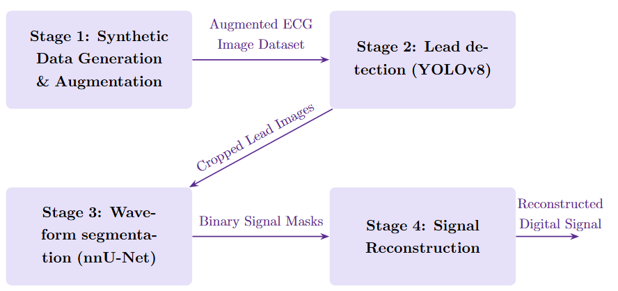

# ECG Project

This project contains code for working with ECG images, including UNet and YOLO models. The following image shows the pipeline 

  

## Directories

*   **code-unet**: Contains code related to the nnU-Net model.
*   **code-yolo**: Contains code related to the YOLOv8 model for object detection on ECG images.
*   **demo**: Contains scripts and data for demonstrating the YOLOv8 and nnU-Net models.
*   **ecg-image-generator**: Contains scripts for generating ECG images from data. This is a modification of the original [ecg-image-kit](https://github.com/alphanumericslab/ecg-image-kit).   
*   **HPC**: Contains scripts for running code on a High-Performance Computing cluster.

