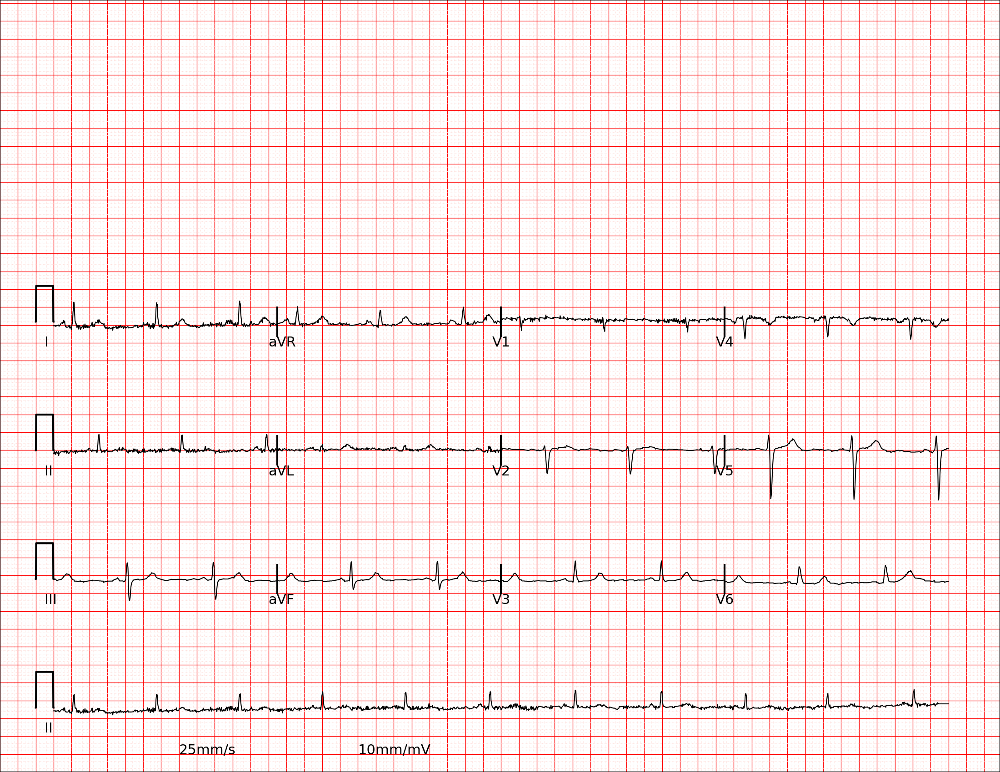
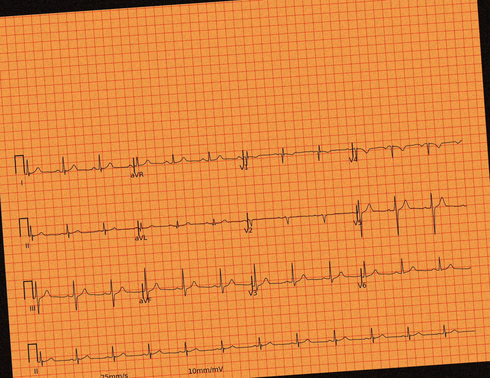
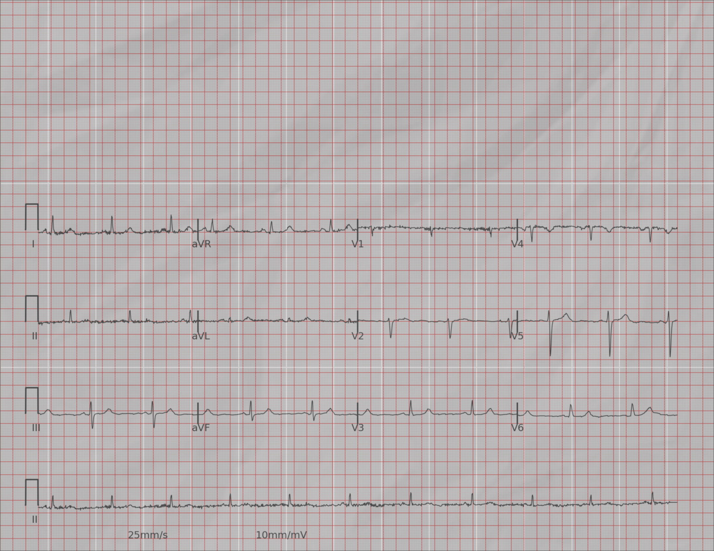
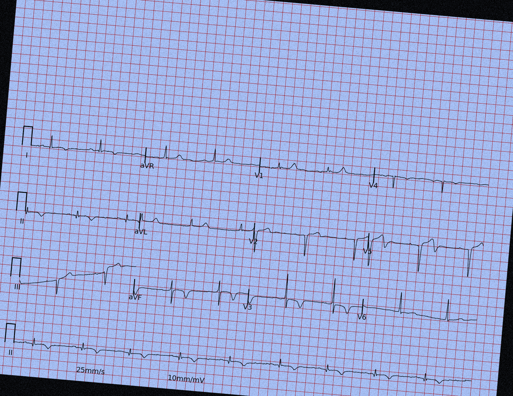

# ECG Project

This project provides a complete workflow for processing ECG images by integrating synthetic ECG creation, YOLOv8 for object detection, nnU-Net for segmentation. The image below visualizes each stage of this pipeline.

  

## Directories
*   **ecg-image-generator**:
Contains scripts for generating ECG images from data. This is a modification of the original [ecg-image-kit](https://github.com/alphanumericslab/ecg-image-kit).
*   **code-unet**: Contains code related to the nnU-Net model.
*   **code-yolo**: Contains code related to the YOLOv8 model for object detection on ECG images.
*   **demo**: Contains scripts and data for demonstrating the YOLOv8 and nnU-Net models.
  
*   **HPC**: Contains scripts for running code on a High-Performance Computing cluster.

    *   **ecg_generator**:
        *   `generate_data.sh`: This script generates a "clean" version of the ECG image dataset. It runs a Python script to convert ECG data into images and corresponding masks without applying any visual augmentations. It also performs an audit of the source data. The following image is an example of a "clean" ECG:
        

          
        

        *   `generate_augmented_data.sh`: This script generates augmented versions of the ECG dataset. It takes an argument that specifies the type of augmentation to apply, such as "scanner" (simulating scanner noise and rotation), "physical" (simulating wrinkled paper), or "chaos" (a combination of augmentations). Based on the chosen type, it passes different flags to the same underlying Python generation script. The following images are example of each inperfection:

        "Scanner":
        

          
        

        "Physical":
        

          
        

        "Chaos":
        

          
        
